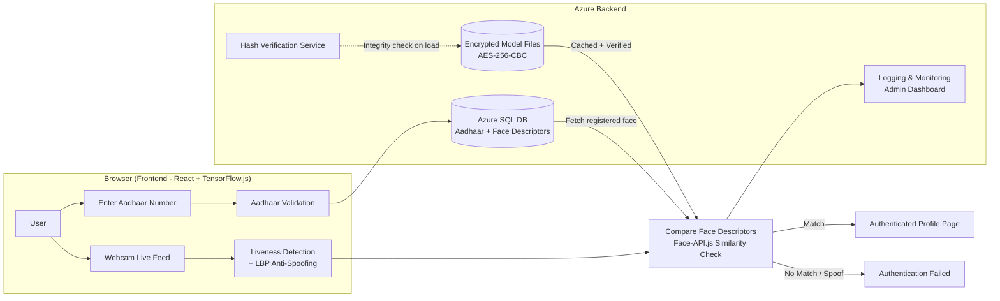
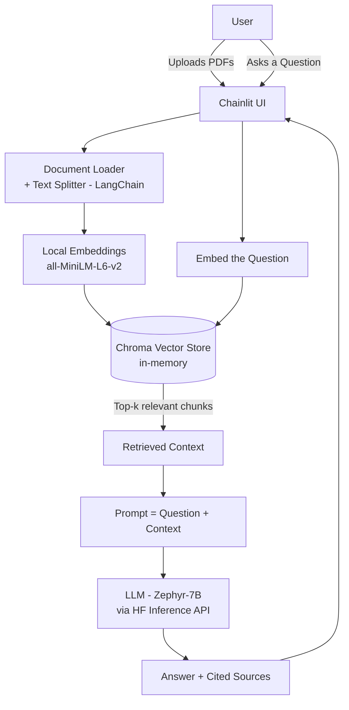
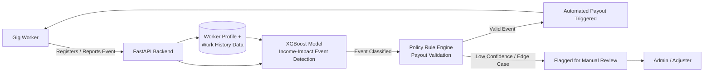

# Projects Interview Guide

A complete, interview-ready breakdown of three projects — **SEAM (Aadhaar Face Authentication)**, **DocuTalk (AI PDF Chatbot)**, and **Aegis (Parametric Wage Insurance System)** — covering the problem statement, what was built, how it works, architecture diagrams, and likely interview Q&A for each.

---

## 1. SEAM — Secure Encryption and Authentication Model

### 🏆 Context
Built for **Smart India Hackathon 2024** (Team SARZ, Team ID 19521) under:
- **PS ID:** SIH1670
- **PS Title:** Develop a functional solution that incorporates the security of the ML model
- **Theme:** Smart Automation | **Category:** Software

### 📌 The Problem Statement (in simple words)
UIDAI (the Aadhaar authority) needed a **browser-based face authentication system** that could:
1. Verify a person's identity in real time using just their webcam and Aadhaar number — no app install needed.
2. Tell the difference between a **real live person** and someone trying to **cheat with a photo or video** (spoofing).
3. Be **lightweight** (5–7 MB) so it works even on slow 3G/4G connections.
4. Most importantly — **protect the AI/ML model itself** from being stolen, tampered with, or reverse-engineered by attackers, since the model contains sensitive logic tied to identity verification.

In short: *"Build a fast, secure, tamper-proof face-login system that runs in a browser and can't be hacked or copied."*

### 🛠️ What I Did (My Contribution & Approach)
- Designed the **end-to-end authentication flow**: user enters Aadhaar number → system fetches registered face data from DB → webcam captures a live frame → both faces are converted into "face descriptors" (numeric fingerprints of a face) → descriptors are compared for similarity.
- Implemented **liveness detection** to catch spoofing — checking things like blinking and head movement, and flagging suspicious inactivity (e.g., a printed photo doesn't blink).
- Added **texture analysis (Local Binary Patterns / LBP)** to distinguish a real face's skin texture from a printed photo or screen replay.
- Solved the **model security problem** (the actual core of the PS) using:
  - **AES-256-CBC encryption** for the ML model files before they're stored on the backend.
  - **Code obfuscation** (Babel + JS obfuscators) so the backend logic can't be read or reverse-engineered.
  - **Hash-based integrity checks** — the browser verifies the model files against server-side hashes before trusting them, so a tampered model is rejected instantly.
  - **Sub-Resource Integrity (SRI)** for any external scripts/stylesheets, so nothing loaded on the page can be silently swapped by an attacker.
- Built a **smart caching strategy**: only the ML model files are cached in the browser (safe, non-sensitive); actual user data (face descriptors, Aadhaar info) is *never* cached — it's loaded into Azure backend RAM only during the authentication request and wiped immediately after ("Just-in-Time" data handling). This fixed an earlier design flaw where cached user data was slowing down the site and creating a privacy/memory risk.
- Set up an **Admin Dashboard / logging system** that records every authentication attempt (success/failure, IP, timestamp) for auditing.
- Performed **security testing** using OWASP ZAP (an automated penetration-testing tool) to scan for vulnerabilities — and iteratively fixed issues like missing security headers between versions.
- Tested extensively for **boundary/edge cases**: people wearing glasses, masks, multiple faces in frame, poor lighting, extreme camera angles, twins, and partial face occlusion — documenting expected vs actual behavior for each.
- Benchmarked performance using **Google Lighthouse** across simulated 3G/4G/5G networks to make sure the app stayed fast and responsive everywhere.

### ⚙️ How It Works — Step by Step
1. **User enters Aadhaar number** → validated against the registered database (green/red visual feedback).
2. **Webcam captures live video** → the system runs face detection and extracts 68 facial landmarks to build a unique facial descriptor.
3. **Liveness & anti-spoofing checks** run in parallel — blinking, movement, and texture analysis reject printed photos or phone-screen replays.
4. **Face descriptors are compared** (live vs. registered) using a similarity threshold (0.45) — powered by Face-API.js / MobileNetV1.
5. If matched → **user is redirected to a profile page** showing "Authentication Successful" with their details.
6. **Post-authentication encryption**: sensitive data is encrypted immediately after processing and cleared from memory — nothing lingers.
7. Every attempt (success or failure) is **logged with metadata** (name, Aadhaar number, IP, timestamp) into a monitoring dashboard.

### 🧰 Tech Stack
| Layer | Technology |
|---|---|
| Frontend | React, Vite, Material UI, TensorFlow.js, Face-API.js |
| Backend | Node.js, Azure App Services, Azure Cloud |
| Database | Azure SQL Database (encrypted storage) |
| Security | AES-256-CBC encryption, JS obfuscation, SRI, Hash verification |
| Anti-Spoofing | Local Binary Patterns (LBP), liveness detection |
| Testing | OWASP ZAP (attack simulation), Google Lighthouse (performance) |
| Deployment | Chrome Web Store (browser extension), Web app |

### 🤖 ML Models Used (Face-API.js Model Suite)
The **main model** used for face detection is **SSD MobileNet V1** — a lightweight Single Shot Detector built on the MobileNet V1 backbone, chosen specifically for its small size and speed, which fits the project's 5–7 MB constraint for smooth downloads over 3G/4G.

| Model File | Purpose |
|---|---|
| `ssd_mobilenetv1_model-shard1` / `shard2` + manifest | **Main model** — Face detection (locates the face in the webcam frame) |
| `face_landmark_68_model-shard1` + manifest | Detects **68 facial landmark points** (eyes, nose, jawline, etc.) used for liveness checks and alignment |
| `face_recognition_model-shard1` / `shard2` + manifest | Generates the **128-D face descriptor** (numeric "fingerprint") used to compare and match faces |

> **Main model to mention: SSD MobileNet V1** — everything else (landmarks, recognition) builds on the face region it detects.

### 🗺️ Architecture Diagram

### 🎤 5 Likely Interview Questions & Answers

**Q1: What was the core problem statement, and what part of it did you personally focus on?**
> A: The PS was to build a functional face-authentication system *and* secure the ML model behind it. While the whole team built the authentication flow, I focused heavily on the security side — encrypting the model with AES-256-CBC, obfuscating the backend code, and building hash-based integrity checks so a tampered or stolen model file would be detected and rejected automatically.

**Q2: How does your system tell the difference between a real person and a photo/video?**
> A: We combine two techniques — liveness detection (monitoring blinking and head movement over time; a static photo never blinks) and texture analysis using Local Binary Patterns, which detects the flat, repetitive texture patterns typical of a printed photo or screen replay versus real skin.

**Q3: Why did you choose to encrypt and obfuscate the model instead of just relying on HTTPS?**
> A: HTTPS only secures data *in transit*. Once the model is downloaded to the browser or sits on the server, HTTPS doesn't protect it from being copied, decompiled, or tampered with. AES-256 encryption keeps the model unreadable at rest, and obfuscation makes reverse-engineering the logic impractical, while hash verification ensures nothing was swapped mid-flight.

**Q4: You mentioned a caching redesign — what problem did it solve?**
> A: Initially we cached both the model files and Aadhaar-related data records, which caused memory bloat and a slower site, plus it meant sensitive user data was sitting in browser storage longer than necessary. We changed it so only the (non-sensitive) model files are cached, while actual user/session data is loaded into backend RAM only for the duration of the authentication request and cleared right after — a "just-in-time" approach that improved both speed and privacy.

**Q5: How did you validate the security of the system?**
> A: We used OWASP ZAP to run automated attack simulations against the live app — things like header checks, injection tests, and vulnerability scans. Early versions showed issues like missing security headers; after implementing HTTPS enforcement, CORS restrictions, DDoS protection (via Azure), and obfuscation, the same scans showed the attack surface reduced significantly, with injection attempts falling "out of scope."

---

## 2. DocuTalk — AI PDF Chatbot (RAG-based Document Q&A)

### 📌 The Problem (in simple words)
People often have long PDF documents (research papers, manuals, reports) and want quick answers without reading the whole thing. The goal was to build a chatbot where a user can **upload one or more PDFs and simply ask questions in plain English**, getting accurate answers **backed by the actual source content** — and to do this **without requiring the user to pay for or provide their own OpenAI/API key**, so anyone could use it for free.

### 🛠️ What I Did
- Built a **Retrieval-Augmented Generation (RAG)** chatbot: instead of asking an LLM to "remember" the PDF content, the system retrieves the *actual relevant chunks* of the PDF first, then feeds them to the LLM to generate a grounded answer.
- Designed the pipeline so a user can **upload up to 10 PDFs at once** and chat with all of them together.
- Chose to power the LLM using the **free Hugging Face serverless Inference API** (`ChatHuggingFace`, model: `HuggingFaceH4/zephyr-7b-beta`) instead of a paid API like OpenAI — meaning end users don't need their own API key; the app's own Hugging Face token is used behind the scenes.
- Ran **embeddings locally on CPU** using `sentence-transformers/all-MiniLM-L6-v2` (via `HuggingFaceEmbeddings`) — this converts each PDF text chunk into a vector representing its meaning, without needing any external paid embedding service.
- Used **Chroma** as an in-memory vector database to store and search these embeddings per session.
- Built the **conversational UI with Chainlit**, which handles file upload, chat history, and streaming responses out of the box.
- Implemented **conversational memory** so follow-up questions ("what about the next section?") stay in context.
- Added **source citation** — every answer shows *which chunk of which PDF* it came from, so answers are verifiable, not hallucinated guesses.
- Containerized the whole app with **Docker** and deployed it as a **Hugging Face Space**, making it publicly accessible with zero setup for the visitor.
- Also added flexibility: if a user *wants* to use a better/paid model, they can optionally set an `OPENROUTER_API_KEY` environment variable and the app automatically switches to OpenRouter instead of the free HF endpoint.

### ⚙️ How It Works — Step by Step
1. **User uploads PDFs** through the Chainlit interface.
2. Each PDF is **split into chunks** (using LangChain's document loaders and text splitters).
3. Each chunk is converted into a **vector embedding** locally (MiniLM model) — capturing its semantic meaning as numbers.
4. All chunk embeddings are stored in **Chroma** (an in-memory vector store) for that session.
5. When the user asks a question, the question itself is embedded and the **most semantically similar chunks are retrieved** from Chroma (this is the "Retrieval" step).
6. The retrieved chunks + the user's question are sent together as a prompt to the **LLM (Zephyr-7B via Hugging Face)**, which generates a natural-language answer grounded in that real content (this is the "Generation" step — together, "Retrieval-Augmented Generation").
7. The answer is displayed along with **citations** pointing to the exact source chunks used.
8. Conversation history is retained so follow-up questions make sense in context.

### 🧰 Tech Stack
| Layer | Technology |
|---|---|
| UI / Chat | Chainlit |
| Orchestration | LangChain |
| LLM | Hugging Face Inference API (Zephyr-7B-beta) / optional OpenRouter |
| Embeddings | sentence-transformers/all-MiniLM-L6-v2 (local, CPU) |
| Vector Store | Chroma (in-memory) |
| Deployment | Docker container on Hugging Face Spaces |
| Language | Python 3.12 |

### 🗺️ Architecture Diagram

### 🎤 5 Likely Interview Questions & Answers

**Q1: What is RAG, and why did you use it instead of just fine-tuning or prompting the LLM directly?**
> A: RAG (Retrieval-Augmented Generation) means the model doesn't rely on its own memory to answer — instead, we first *retrieve* the actual relevant text from the uploaded PDF, and only *then* ask the LLM to generate an answer using that real content. This avoids hallucination, works with any document instantly (no fine-tuning needed), and lets us cite exact sources.

**Q2: How do you make sure users don't need to provide an API key?**
> A: The app is deployed on Hugging Face Spaces and uses the Space's own Hugging Face token to call the free serverless Inference API for both the LLM and reuses local, open-source embedding models that run on CPU — so there's zero cost or setup burden on the end user. There's an optional path to plug in OpenRouter if someone wants a stronger model, but it's not required.

**Q3: What's the difference between the embedding model and the chat/LLM model here?**
> A: The embedding model (MiniLM) doesn't generate text — it converts text into a numeric vector that captures meaning, used purely for *similarity search* (finding which chunks are relevant). The chat model (Zephyr-7B) is the one that actually reads the retrieved context and writes a natural-language answer. Using a small, local embedding model keeps that part fast and free, while the heavier language generation is offloaded to the hosted LLM.

**Q4: Why Chroma, and is it persistent?**
> A: Chroma is a lightweight, easy-to-integrate vector database that works well in-memory for a single session — perfect for a use case where each user's uploaded PDFs are scoped to their own chat session and don't need to persist across restarts. It's fast to set up and doesn't need external infrastructure.

**Q5: How does the app handle multiple PDFs at once, and how does it decide which document an answer came from?**
> A: All chunks from all uploaded PDFs (up to 10) are embedded and stored together in the same vector store, tagged with metadata about their source file. When a question is asked, the retrieval step pulls the most relevant chunks *regardless of which file they came from*, and the citation step uses that stored metadata to tell the user exactly which document (and section) the answer was based on.

---

## 3. Aegis — Parametric Wage Insurance System

### 📌 The Problem (in simple words)
Gig workers (delivery partners, freelancers, cab drivers, etc.) don't have the safety net that traditional salaried employees have — no paid sick leave, no automatic compensation if an external event (illness, accident, platform outage, natural disaster) stops them from earning. Traditional insurance requires manual claims, paperwork, and long wait times, which doesn't work for someone who needs quick relief. The goal was to design an **automated, "parametric" insurance system** — one where payouts are triggered automatically based on measurable, predefined conditions (a "parameter" being met, like verified loss of income), instead of requiring a lengthy manual claims process.

### 🛠️ What I Did
- Designed and built the **backend API layer using FastAPI**, which exposes endpoints for registering gig workers, checking income-impact events, and processing payouts.
- Integrated a **machine learning model (XGBoost)** trained to detect "income-impact events" — patterns in a worker's data (e.g., a sudden drop in completed trips/tasks, verified incident reports) that indicate a genuine loss of earning capacity, rather than someone simply choosing not to work.
- Built the **automated payout validation workflow**: once the ML model flags a valid income-impact event, the system automatically validates it against policy rules and triggers a payout — removing the need for manual claims adjusters for straightforward cases.
- Focused on making the system **"parametric"** — meaning payout doesn't depend on subjective claim assessment, but on objective, pre-agreed parameters/data thresholds being crossed, which makes payouts faster and more transparent.
- Structured the backend to be **modular**, separating the API layer (FastAPI routes), the ML inference layer (XGBoost model serving), and the business logic layer (policy/payout rules) so each part could be developed, tested, and improved independently.

### ⚙️ How It Works — Step by Step
1. A gig worker is **registered** into the system with basic profile and work-pattern data (e.g., historical earnings, work frequency).
2. The system continuously (or on-trigger) **monitors incoming data** — e.g., a reported incident, a sharp drop in activity, or a claim submission.
3. The **XGBoost model** analyzes this data against learned patterns to classify whether this looks like a genuine **income-impact event** (illness, accident, disruption) versus normal behavior.
4. If the event is classified as valid, the system runs it through **automated payout validation** — checking it against policy parameters (e.g., minimum work history, event severity threshold).
5. If validation passes, a **payout is triggered automatically** through the FastAPI backend — no manual claim form or adjuster review needed for standard cases.
6. Edge cases or low-confidence predictions can still be flagged for manual review, keeping the system safe from false payouts.

### 🧰 Tech Stack
| Layer | Technology |
|---|---|
| Backend / API | FastAPI (Python) |
| Machine Learning | XGBoost (gradient-boosted decision trees) |
| Core Concept | Parametric insurance (rule + ML-triggered payouts) |
| Target Users | Gig economy workers |

### 🗺️ Architecture Diagram

### 🎤 5 Likely Interview Questions & Answers

**Q1: What does "parametric insurance" mean, and why is it better suited for gig workers than traditional insurance?**
> A: Parametric insurance pays out automatically when a predefined, measurable condition (a "parameter") is met — like a verified drop in completed trips or a confirmed incident — instead of requiring the policyholder to file a claim and wait for manual assessment. For gig workers who need quick financial relief and often lack the paperwork trail salaried employees have, this speed and objectivity is a much better fit.

**Q2: Why did you choose XGBoost for detecting income-impact events specifically?**
> A: XGBoost works very well on structured/tabular data — which is exactly what we have here (work history, frequency, verified incident flags, etc.) — and it's fast, interpretable relative to deep learning, and handles imbalanced data well, which matters since genuine income-impact events are relatively rare compared to normal work patterns.

**Q3: How do you prevent fraud — someone gaming the system to get a payout without a genuine event?**
> A: The ML model doesn't work in isolation — its output is passed through a policy rule engine that cross-checks event classification against objective thresholds (like minimum work history or corroborating data). Low-confidence or borderline cases are automatically routed to manual review instead of an automatic payout, so the system stays conservative on ambiguous cases.

**Q4: Why FastAPI over something like Flask or Django for the backend?**
> A: FastAPI gives us async support out of the box (important for handling many concurrent requests from gig workers), automatic request/response validation via Pydantic, and auto-generated API documentation — which made it faster to build, test, and integrate the ML inference layer cleanly as its own service.

**Q5: How would this system scale if millions of gig workers used it?**
> A: The architecture separates concerns cleanly — the FastAPI layer can be horizontally scaled behind a load balancer, the XGBoost model can be served as a separate inference service (so it can be scaled or swapped independently), and the rule engine/payout logic can be queued asynchronously so spikes in event reports (e.g., a citywide disruption) don't overwhelm the payout pipeline all at once.

---

## Quick Comparison Cheat-Sheet

| Project | Domain | Core Tech | Problem Solved |
|---|---|---|---|
| **SEAM** | Identity Security / Biometrics | React, TensorFlow.js, Azure, AES-256, LBP | Secure, tamper-proof browser-based Aadhaar face authentication |
| **DocuTalk** | AI / NLP (RAG) | LangChain, Chainlit, Hugging Face, Chroma | Free, chat-based Q&A over any uploaded PDF with source citations |
| **Aegis** | FinTech / InsurTech | FastAPI, XGBoost | Automated, rule + ML-driven payouts for gig-worker wage insurance |

---
*Prepared as a personal interview-reference guide covering technical depth, design rationale, and anticipated Q&A for all three projects.*
